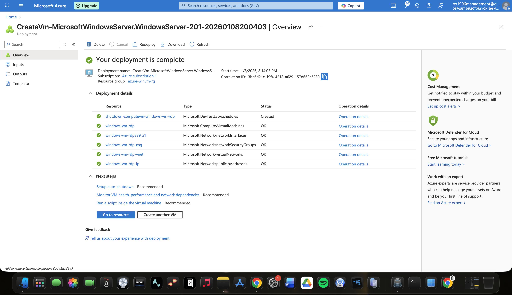
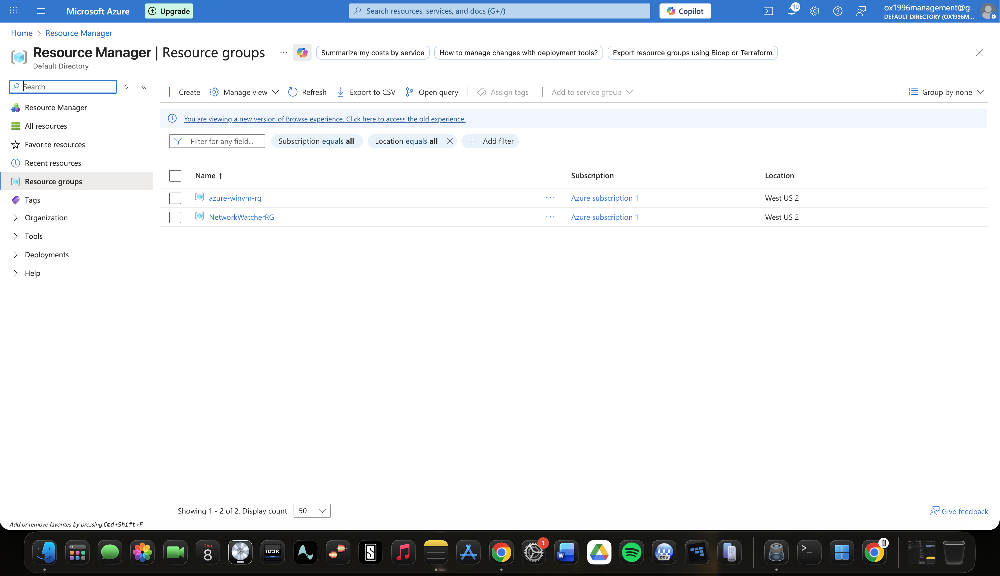
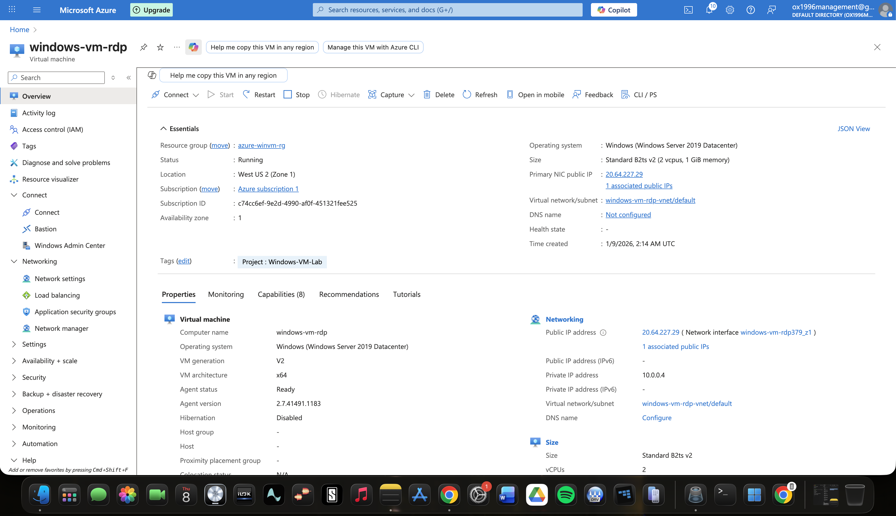
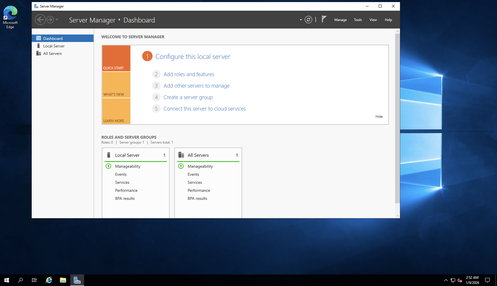
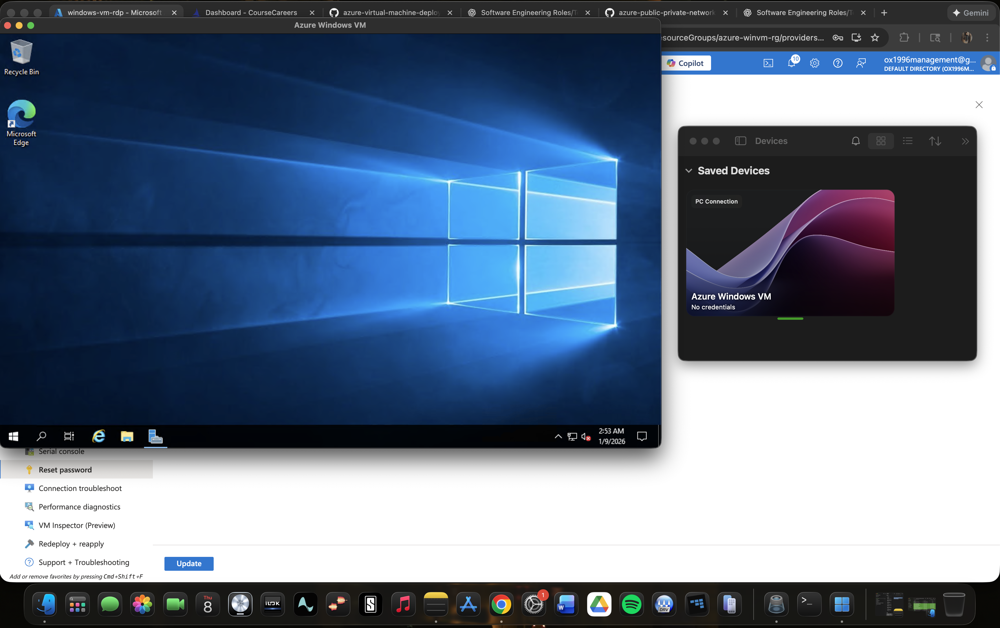
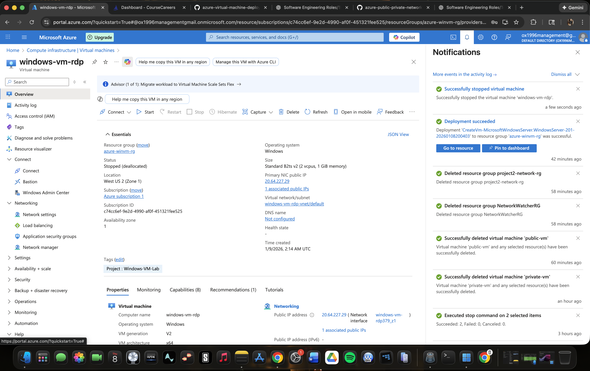
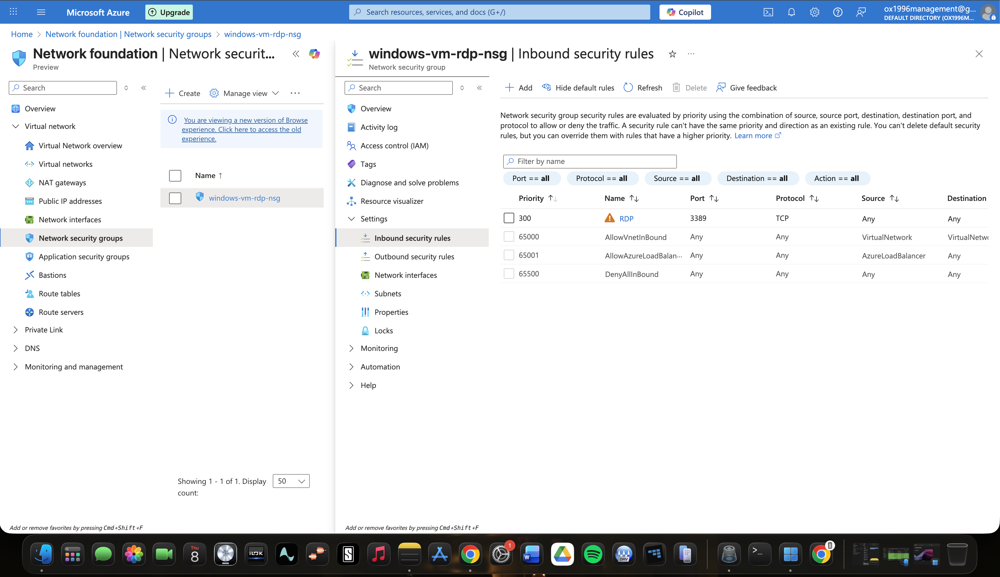

# Azure Windows VM RDP Project

## Overview
This project demonstrates deploying a Windows Server virtual machine in Microsoft Azure and securely accessing it using Remote Desktop Protocol (RDP) from a macOS device. The project highlights core cloud engineering concepts including resource groups, virtual machines, networking, security groups, and remote access.

---

## Step 1: Deployment Completed
I confirmed that the Azure virtual machine deployment completed successfully and all required resources were created.

---

## Step 2: Resource Group Created
I verified that the dedicated Azure resource group for the Windows VM was successfully created and organized correctly.

---

## Step 3: Windows Virtual Machine Overview
I reviewed the Windows virtual machine overview page to confirm the VM status, region, size, operating system, and assigned public IP address.

---

## Step 4: Windows Server Desktop Access
After connecting to the VM, I confirmed access to the Windows Server desktop environment.

---

## Step 5: RDP Connection from macOS
I used Microsoft Remote Desktop on macOS to securely connect to the Azure-hosted Windows virtual machine.

---

## Step 6: VM Stopped and Deallocated
I stopped and deallocated the virtual machine to prevent unnecessary Azure usage and cost when the VM was not in use.

---

## Step 7: Network Security Group Overview
I reviewed the Network Security Group (NSG) configuration to ensure RDP traffic on port 3389 was explicitly allowed.

---

## Key Skills Demonstrated
- Azure Virtual Machine deployment
- Windows Server administration
- Resource group management
- Network Security Group (NSG) configuration
- Secure RDP access
- Cost management through VM deallocation
- Cloud infrastructure documentation

---

## Outcome
This project demonstrates hands-on experience with Azure compute resources, secure remote access, and cloud cost optimization — foundational skills for a Cloud Engineer role.
